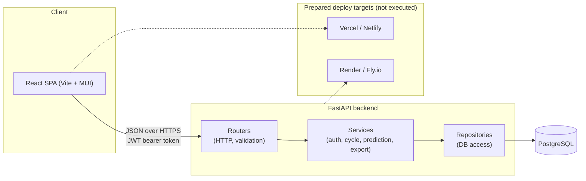
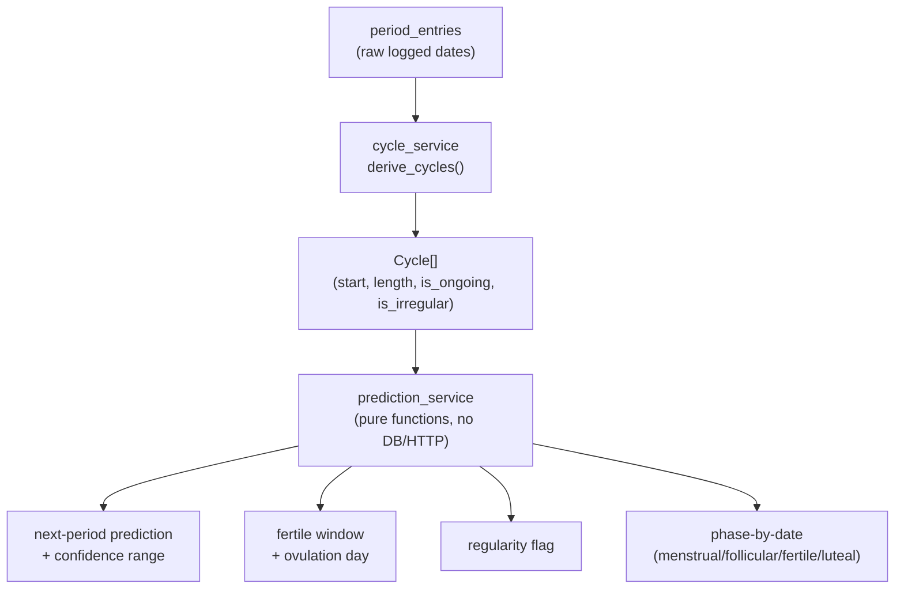

# Cycle Tracker

A full-stack period and cycle tracking app: log periods, symptoms, basal body
temperature, cervical mucus, and ovulation tests, then get next-period and fertile-window
predictions from a hand-rolled, unit-tested statistical model — with a calendar and
dashboard on top.

Built as a portfolio project to demonstrate a layered backend architecture, a properly
tested prediction algorithm, and a working CI/Docker setup end to end, rather than just a
CRUD app with a database.

## Tech stack

| Layer | Choice |
|---|---|
| Backend | FastAPI (async), Pydantic v2, SQLAlchemy 2.0 (async), Alembic |
| Database | PostgreSQL (production/Docker), SQLite (local dev) |
| Auth | JWT access tokens + opaque, hashed, revocable refresh tokens; bcrypt password hashing |
| Frontend | React 19 + TypeScript + Vite, MUI, Recharts |
| Testing | pytest + httpx (backend), Vitest + React Testing Library (frontend) |
| CI | GitHub Actions — lint + typecheck + test on every push/PR, per-package |
| Containers | Docker + docker-compose (db / api / web) |
| Deploy targets | Render or Fly.io (API), Vercel or Netlify (frontend) — configs included, not executed |

## Architecture



The prediction engine is deliberately isolated from the web layer:



`cycle_service` and `prediction_service` take/return plain dataclasses and have no
FastAPI, SQLAlchemy, or HTTP imports — they're unit-tested directly (see
`backend/tests/unit/test_prediction_service.py`) against synthetic cycle histories: no
data, a single cycle, perfectly regular cycles, high-variance cycles, and a single outlier
cycle skewing a recency-weighted average.

### Prediction algorithm, in short

- **Next period** = last period start + a recency-weighted average of the last 6 completed
  cycle lengths (exponential decay, more recent cycles count more).
- **Confidence range** = ± the weighted standard deviation of those lengths — tight for a
  consistent cycler, wide for an irregular one, and explicitly low-confidence with fewer
  than 2 completed cycles.
- **Ovulation / fertile window** = predicted next period − a 14-day luteal-phase estimate,
  with a 5-day-before to 1-day-after window around it.
- **Irregularity** is flagged when recent cycle length variance exceeds a threshold or any
  recent cycle falls outside the typical 21–35 day range.

## Repository structure

```
Ptracker/
  backend/
    app/
      core/        config (pydantic-settings), JWT + password hashing, auth dependency
      db/          SQLAlchemy session/base
      models/      SQLAlchemy models (users, periods, symptoms, bbt, cervical mucus, ovulation tests, tokens)
      schemas/     Pydantic request/response models
      repositories/  thin DB-access layer, one per resource
      services/    auth, log CRUD, cycle derivation, prediction, dashboard, export
      routers/     FastAPI routers — one per resource
      main.py
    alembic/       migrations (incl. a seed migration for the symptom lookup table)
    tests/
      unit/        prediction algorithm, security, config — no DB/HTTP
      integration/ httpx-driven API tests, plus a migration regression test
    Dockerfile
  frontend/
    src/
      api/         axios client (silent access-token refresh) + typed endpoint wrappers
      auth/        AuthContext, useAuth, ProtectedRoute
      components/  layout + one form per log type
      pages/       Login, Register, Dashboard, Calendar, Log Entry, Trends, Settings
      utils/       client-side phase-by-date mirror (calendar color-coding), chart data shaping
      types/       API types mirroring the backend Pydantic schemas
    Dockerfile, nginx.conf
  docker-compose.yml       db (Postgres) + api + web
  .github/workflows/       backend-ci.yml, frontend-ci.yml
  render.yaml, fly.toml, frontend/vercel.json, frontend/netlify.toml   (prepared, unused)
```

## API route map

All routes are under `/api/v1`. Full interactive docs (Swagger UI) are served at `/docs`
once the backend is running.

**Auth** — `POST /auth/register`, `POST /auth/login`, `POST /auth/refresh`,
`POST /auth/logout`, `POST /auth/password-reset/request`, `POST /auth/password-reset/confirm`
(stub — logs the reset token instead of emailing it), `GET /auth/me`

**Logging** (same CRUD shape per resource, scoped to the authenticated user) —
`/periods`, `/symptom-logs` (+ `GET /symptoms` for the lookup list), `/bbt`,
`/cervical-mucus`, `/ovulation-tests`

**Predictions & insights** — `GET /cycles`, `GET /predictions/next-period`,
`GET /predictions/fertile-window`, `GET /insights/cycle-length-trend`,
`GET /insights/symptom-frequency`, `GET /dashboard/summary`

**Data & privacy** — `GET /export/csv`, `GET /export/pdf`, `DELETE /account`
(GDPR-style deletion, cascades to every log table)

## Quickstart

### Option A — Docker Compose (closest to production)

```bash
cp .env.example .env        # adjust POSTGRES_*/SECRET_KEY if you want
docker compose up --build
```

- API: http://localhost:8000 (docs at `/docs`)
- Frontend: http://localhost:5173

The API container runs Alembic migrations (including the symptom seed data) on startup
before serving traffic.

### Option B — Run locally without Docker

**Backend** (Python 3.12+; SQLite by default, no Postgres needed for local dev):

```bash
cd backend
python3 -m venv .venv && source .venv/bin/activate
pip install -r requirements-dev.txt
cp .env.example .env
alembic upgrade head
uvicorn app.main:app --reload
```

**Frontend** (Node 20+):

```bash
cd frontend
npm install
cp .env.example .env   # points at http://localhost:8000/api/v1 by default
npm run dev
```

Visit http://localhost:5173, register an account, and start logging.

## Testing

```bash
# Backend — 88 tests (unit: prediction algorithm, security, config; integration: httpx-driven API + a migration regression test)
cd backend && source .venv/bin/activate
pytest
ruff check app tests && black --check app tests

# Frontend — 19 tests (auth flow, route protection, calendar phase logic, chart data shaping)
cd frontend
npm run test
npm run lint && npm run build   # build runs the TypeScript typecheck too
```

Both suites run in CI on every push/PR that touches their half of the repo
(`.github/workflows/backend-ci.yml`, `frontend-ci.yml`).

## Deployment

Configs are prepared but not wired to any live account — connecting them requires your
own Render/Fly/Vercel/Netlify login, so that's left to you:

- **Backend → Render**: connect this repo, "New +" → "Blueprint", point it at
  `render.yaml` (provisions the API + a managed Postgres together).
- **Backend → Fly.io**: `fly launch --copy-config --no-deploy` once to link an app name,
  `fly postgres create` + `fly postgres attach` for a database, `fly secrets set
  SECRET_KEY=...`, then `fly deploy` (builds `backend/Dockerfile`).
- **Frontend → Vercel**: import the repo, set the project's root directory to `frontend`,
  set `VITE_API_BASE_URL` to your deployed API's `/api/v1` URL. `frontend/vercel.json`
  handles the SPA rewrite.
- **Frontend → Netlify**: same idea via `frontend/netlify.toml`.

Whichever backend host you pick, set its CORS_ORIGINS env var to your frontend's deployed
URL (see `backend/.env.example`) — the deploy configs above default to a placeholder.

## Notable engineering decisions

- **Cycles aren't stored** — `period_entries` (one row per logged period day) is the
  source of truth, and `cycle_service.derive_cycles()` groups them into cycles on the
  fly. This avoids ever having a derived table go stale relative to the raw logs, and it's
  what makes the prediction algorithm a pure, trivially-testable function of the log data.
- **Refresh tokens are opaque and hashed at rest**, not JWTs — that's what makes
  server-side revocation on logout actually work; a JWT refresh token can't be revoked
  without a separate blocklist anyway, so there's no advantage to it over a random token
  looked up by its SHA-256 hash.
- **Password reset is stubbed by logging the token server-side** instead of sending real
  email, called out explicitly rather than silently faked — see
  `AuthService.request_password_reset`.
